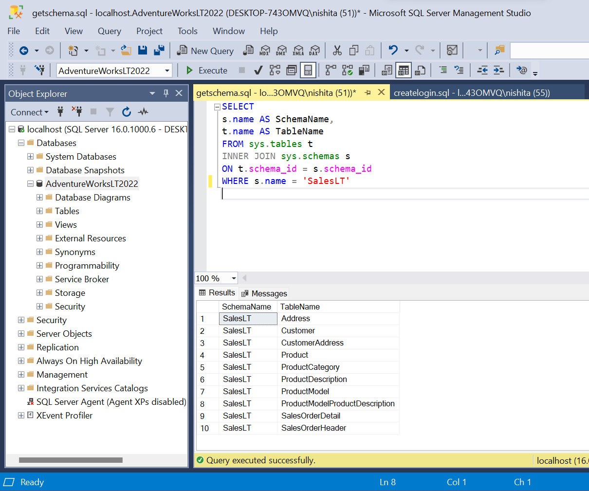
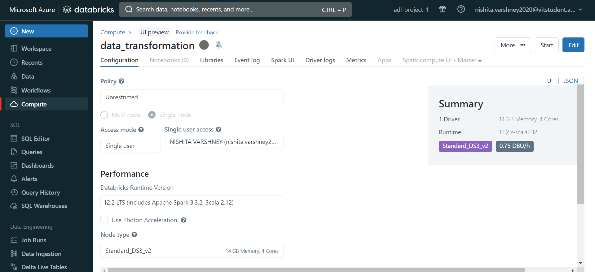
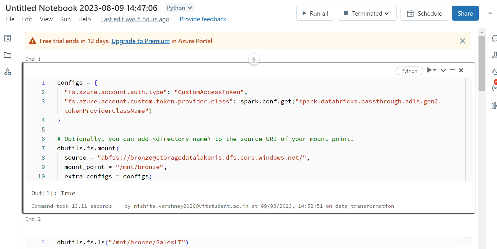

# Microsoft Azure End-to-end Data Engineering Project

Migrating On-premise SQL database to Cloud

---

### Environment Setup

We create a new resource group named: azure-project-1

Next, we need to create instances of the following resources in the resource group namely:

1. Azure databricks: Transforms raw data to curated data. It’s a big data analytics tool used for high-end data analytics workloads. Using databricks we can write codes in any of these languages: Python, scala, R, SQL 
2. Azure data factory: ETL Tool used for data Ingestion
3. Azure keyvault : Used to store the secrets on cloud
4. Azure data lake: Storage solution in Azure
5. Azure synapse analytics 

**Note:** data lake and databricks together form the Lakehouse Architecture.

Azure data lake is divided into multiple layers:

- BRONZE: Source of truth (contains the original data)
- SILVER: Contains the data after first set of transformation using DataBricks (1st layer of Transformation)
- GOLD: Contains the data after second set of transformation using DataBricks (2nd layer of Transformation)

Data gets loaded into the bronze layer from the Azure Data Factory , then to the Silver layer and then to the Gold layer. After the data is loaded into the gold layer, we connect it to the Azure Synapse Analytics(Used for creating and storing databases on the cloud)

After this step Azure Synapse Analytics has a similar Data Warehousing Model as compared to the on-premise SQL Database.

After loading the data into synapse analytics we can create reports and dashboards out of it using powerBI.

We will be creating Pipelines for this project to automate these end-to-end data solutions as data engineers do.

We use the following link to install SSMS, SQL server and SAMPLE adventure works database provided by Microsoft for the following project. By following the steps given here, we can restore the adventure works database into the SQL server management studio (SSMS). 

https://learn.microsoft.com/en-us/sql/samples/adventureworks-install-configure?view=sql-server-ver16&tabs=ssms

After the setup is done, it will look something like this:

The role of db reader has been given to the user nishita by executing the following SQL file

Next we need to store the username and password in the keyvault:

Go to Keyvault -> Secrets -> Generate/Import and you will be able to store them in an encrypted manner.

The keyvault stores the encrypted credentials to store the username and the password used to authenticate and connect the on-prem database to the synapse analytics.

### Data Ingestion

1. We launch the azure data factory workspace and establish the INTEGRATION RUNTIME. The Auto Resolve Integration runtime helps us to connect to any of the cloud services. But to be able to connect to the On-premise database we need to have the Self Host Integration Runtime established.  We establish that by clicking on NEW and following the steps succeeding it.

Here we have our Self Hosted Integration Runtime Installed

Now we can create a new Pipeline for the data Ingestion of One single Table in the Data Factory:

Go to Pipeline -> New Pipeline -> change the pipeline name according to your preference

In the activities section-> Go to  copy data and drag the copy data activity and put It into the whitespace.

The next step is to configure the SOURCE and the SINK

1. Configuring the SOURCE (connects on-premise database to Azure Data Factory) For configuring the source follow the steps given in the below images:

After you enter everything successfully, You’ll be able to land on this page where your pipeline has access to choose any table from your database.

Choose SalesLT.Address and move ahead to the sink configuration.

2. Configuring the SINK(connects Azure Data Factory to Azure Data Lake where the data will be stored)

Select Azure Data Lake Storage Gen2 -> parquet -> enter the details as follows

After this, you need to enter the location where you want to save your file. For saving the file -> We will use Containers in Azure.

To create a container:

Go to your resource group -> Data lake -> Containers in the Data Table section and hit create to create the container named Bronze over there. 

Come back to Data Factory and specify the Linked Service file path as bronze by browsing through the section.

Click on Debug and see if the pipeline is successful or not. On success it will look something like this:

This is how the data in the SalesLT.Address table looks like.

At the end, To save your pipeline -> click on Publish 

This will save your pipeline and automate the task for you. Everytime you add any other records to the on-premise database it automatically will get added to the cloud and you don’t have to write any extra code for it.

Now, we will copy all the tables onto cloud. For this, we make another pipeline in the same manner as we made the first pipeline but the only difference will be that instead of choosing any tables explicitly we will be using Add Dynamic Content where we will be writing the codes and specifying what we need.

1. To start the pipeline creation process, follow the same steps: Go to pipeline -> create new pipeline.
2. Go to the SQL Server and Execute the script getschema.sql attached in this repository.

This will look something like this:

3. Go to data factory and create new activity: lookup and drag it to the whitespace.

Go to settings -> new -> fill the desired columns. 

Change the USE QUERY to Query instead of Table and then go to SSMS and copy the same query that we executed there and paste it over here in the Query box.

When we execute the lookup activity, it will use the same query to query the on-premise SQL Server Database using the linked server connection.

On clicking on Preview Data we will be able to see all the tables as we were able to see in the SSMS SQL Server Database.

4. Next Step is to check how to use the lookup activity to copy all the tables. For that execute the Debug command -> on success the input script will look like this: (it’s the sql query we gave)

5. And the Output is the name of list of all schema tables (generates name of all schemas and table names in a JSON format)

6. we use this JSON Structure to copy the tables from the source. 

For that use ForEach activity and connect the ForEach activity to the Lookup activity on success. The ForEach activity runs only if the lookup activity gets successfully completed.

For Each activity can be compared to the for each loop we use when we code.

It iterates through a list , every Schema and Table are given to the ForEach as an input and hence in this case the foreach runs 10 times.

7. For configuring the ForEach activity:

Go to Settings -> Items -> Add Dynamic Content and paste the following Dynamic Expression:

8. Now go to Activities -> Edit and then drag the copy data activity to the whitespace. Now, we again configure 2 things which are:

    1. SOURCE

       Follow the same steps we followed when we were copying only 1 table but DO NOT explicitly select any table name.

       After that is configured, enter the following Dynamic content to the Query:

       @{concat('SELECT * FROM ', item().SchemaName, '.', item().TableName)}

     2. SINK

        Follow the same steps and select the bronze container.

        We want the folder structure in this format:

        Bronze/Schema/TableName/TableName.parquet

        Bronze is the folder

        Schema is salesLT

        FOLDER tablename has tablenames

        Then inside that we have the parquet file of the table we are copying.

We need to go to sink and assign these parameters to the sink

9. Go to sink-> connection and then enter the following dynamic content in the Directory and FileName respectively:

    1. @{concat(dataset().schemaname, '/',dataset().tablename)}

    2. @{concat(dataset().tablename,'.parquet')}

10. After this step, publish all changes and hit the Add Trigger button to execute and see if the pipeline runs successfully.

The folder bronze has all the table names in the SalesLT Schema:

### Data Transformation

For doing the Data Transformation Task, we will be using Azure Databricks workspace.

The data tab in databricks is used for creating and storing the data whereas the compute tab is used the most because databricks is a data transformation resource and to do any type of data transformation we need compute power. We need to create clusters , more often called as spark clusters for the computation.

The workflow tab is used for creating the job using the notebooks that we have inside the workspace.

1. Create a compute cluster/spark cluster to create the notebooks

This is how the cluster looks after the creation.

2. This is how we connect databricks to azure datalake

3.To create notebooks -> you can go to Workspace -> Shared -> create new notebook. This is how it will look like. The ipynb are attached for the reference.

The mount point is used to access the data in the bronze container.

3. For the 1st level transformation, we want to convert DateTime format to Date Format:

The code is given in the [bronze_to_silver.ipynb](bronze_to_silver.ipynb) attached. 

(the codes are written in pySpark)

4. For the 2nd level transformation, we want to follow naming convention where we want to split the two words and put and underscore between them

The code is given in the [silver_to_gold.ipynb](silver_to_gold.ipynb) attached.

5. Now we go to azure data factory again and create pipeline such that we can run these two notebooks. In order to do that we create a link between data factory and databricks by going to linked services tab. 

6.Go to databricks and generate new token in the user settings tab

7. Copy the tokenID and create a secret in KeyVault for this token and use it to link databricks to data factory in the linked services.

8. Select notebook activity from the activity section and drag two notebooks to the whitespace and connect them to the ForEach on success. First notebook is bronze to silver notebook and the second one is silver to gold notebook.

9. This is the final pipeline created. Click on Add Trigger to trigger and see if the pipeline runs successfully. It will look like this after successful completion.

10. Lastly we can load all this data into a database using Azure Synapse Analytics and if we want to present the data and do some analysis we can create repots and dashboards using microsoft PowerBI.
